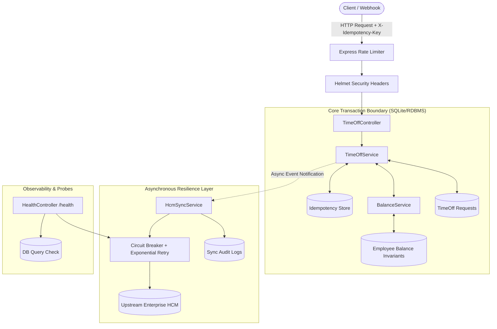
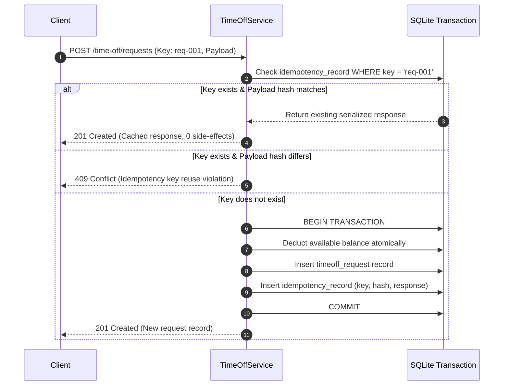
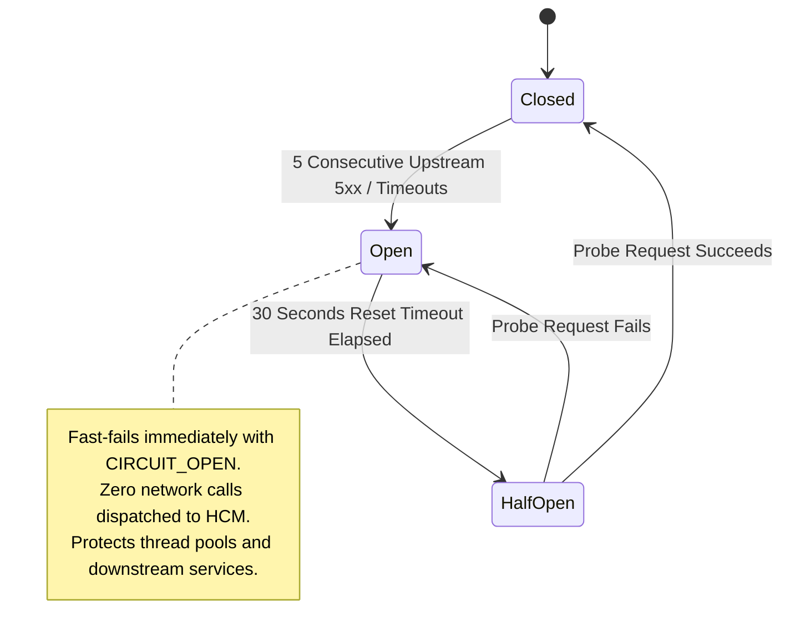

# Resilient Time-Off Microservice: Architecture & Concurrency Case Study

[](https://github.com/Asadshah7950/time-off-microservice/actions/workflows/ci.yml)
[](LICENSE)
[](https://nestjs.com)
[](https://nodejs.org)
[](https://jestjs.io)
[](Dockerfile)

A production-engineered NestJS time-off microservice designed to solve the **dual-write problem**, **concurrency race conditions**, and **upstream HCM (Human Capital Management) instability** through idempotent writes, strict balance invariants, and circuit-broken eventual consistency.

---

## 1. The Engineering Problem

In distributed enterprise HR architectures, time-off systems face three fundamental failure modes:

1. **The Dual-Write Hazard**: Updating a local balance while synchronously calling a third-party HCM system (e.g. Workday, BambooHR) means network failures, timeouts, or 5xx crashes leave systems permanently out of sync.
2. **Concurrency Invariant Violations**: Two simultaneous requests from the same employee (or manager) can read identical available balances, pass initial validation, and deduct balance concurrently—resulting in negative leave days.
3. **Upstream Cascade Failures**: When the external HCM experiences degraded performance or downtime, client-facing leave requests time out, thread pools exhaust, and the microservice collapses.

This service eliminates these failure modes using **transactional idempotency**, **atomic balance deduction**, **local-first commit**, and **asynchronous reconciliation with circuit breaking**.

---

## 2. System Architecture & Component Boundaries



---

## 3. Core Architectural Guarantees

### Guarantee 1: Exactly-Once Processing (Idempotency)
Every write request requires an `X-Idempotency-Key` header. The request payload is canonicalized and hashed (SHA-256).



### Guarantee 2: Balance Invariant Enforcement
At all times, the system enforces the invariant:
$$	ext{available} + 	ext{pending} + 	ext{used} = 	ext{total}$$

#### Concurrency Proof: Why Two Concurrent Requests Cannot Corrupt Balance
Suppose Employee `EMP101` has `available = 5`, `pending = 0`, `used = 0`, `total = 5`. Two concurrent requests $R_1$ (3 days) and $R_2$ (3 days) arrive simultaneously:

```sql
-- Atomic Conditional Update executed within transaction
UPDATE employee_balance 
SET available = available - :daysRequested, 
    pending = pending + :daysRequested, 
    version = version + 1
WHERE id = :id 
  AND available >= :daysRequested;
```

1. **Request 1** enters the transaction first:
   - Condition `available >= 3` evaluates to `5 >= 3` (True).
   - Rows affected: `1`.
   - State becomes: `available = 2`, `pending = 3`, `total = 5`.
2. **Request 2** evaluates the update:
   - Condition `available >= 3` evaluates to `2 >= 3` (False).
   - Rows affected: `0`.
   - `BalanceService` detects `affectedRows === 0` and throws `UnprocessableEntityException: Insufficient leave balance`.
   - Transaction rolls back cleanly.
3. **Mathematical Result**: The balance never drops below zero, and no race condition can over-allocate leave.

---

## 4. Upstream HCM Synchronization & Circuit Breaker

The service never blocks client responses on external network calls. Local changes commit first, and HCM synchronization is handled asynchronously.



### Failure Recovery Matrix

| Failure Scenario | Local Database State | Upstream HCM State | System Recovery Action |
| :--- | :--- | :--- | :--- |
| **HCM Outage on Create** | Request saved as `PENDING`, balance reserved | Not notified | Asynchronous retry worker retries with exponential backoff (1s, 2s, 4s). |
| **Prolonged HCM Outage** | Multiple requests queued with `hcmSyncStatus = PENDING` | Out of sync | Circuit breaker trips to `OPEN`. Batch sync cron (`/hcm/batch-sync`) reconciles state when HCM recovers. |
| **Anniversary / Upstream Drift** | Local: 12 days, Upstream: 14 days | Upstream added 2 days | Drift detection recognizes positive drift: atomically increments `available` and `total` by 2. |
| **Negative Drift (Conflict)** | Local: 12 days, Upstream: 10 days | Discrepancy detected | Non-destructive: preserves local approved leaves, logs discrepancy in `sync_log` for manual HR audit. |

---

## 5. Comprehensive Test Suite

The test suite is **failure-mode driven**, testing race conditions, transient outages, network timeouts, and invalid transitions.

```bash
# Run complete test suite (Unit, Integration, E2E)
npm test

# Run with full coverage table
npm run test:coverage
```

### Verified Test Results
```text
Test Suites: 11 passed, 11 total
Tests:       102 passed, 102 total
Snapshots:   0 total
Time:        ~95s across full integration matrix
Coverage:    94.03% Statements | 84.98% Branches | 91.66% Functions | 94.64% Lines
```

### Test Suite Breakdown
* `test/unit/timeoff.service.spec.js`: Concurrency locks, transaction rollbacks, date validation, status state machine.
* `test/unit/balance.service.spec.js`: Balance invariants, atomic deduction, underflow rejection, drift handling.
* `test/unit/circuit-breaker.util.spec.js`: Half-open probes, failure threshold tripping, reset windows.
* `test/unit/retry.util.spec.js`: Retryable vs deterministic error filtering, max attempt exhaustion.
* `test/unit/health.controller.spec.js`: Liveness/readiness probes, DB query failure handling, circuit degradation.
* `test/integration/timeoff.integration.spec.js`: Full SQLite + Mock HCM integration (race conditions, transient recovery, batch sync).
* `test/e2e/timeoff.e2e-spec.js`: End-to-end HTTP request flows with headers and status assertions.

---

## 6. Production Readiness & Observability

### Healthcheck Probe (`GET /health`)
Returns live infrastructure diagnostics for Kubernetes liveness/readiness probes:

```json
{
  "status": "UP",
  "timestamp": "2026-09-08T15:20:00.000Z",
  "uptimeSeconds": 3600,
  "details": {
    "database": {
      "status": "UP",
      "driver": "sqlite"
    },
    "hcmCircuitBreaker": {
      "state": "CLOSED",
      "consecutiveFailures": 0,
      "nextAttemptAt": null
    }
  }
}
```
*Note: If the upstream HCM circuit breaker is `OPEN`, the endpoint returns `200 OK` with status `DEGRADED`, indicating the service is accepting writes locally while upstream sync is paused.*

---

## 7. Quickstart & Deployment

### Run with Docker Compose (Recommended)
Spins up both the Time-Off service and the upstream Mock HCM server in an isolated bridge network:

```bash
docker-compose up --build
```

### Run Locally
```bash
# 1. Install dependencies
npm ci

# 2. Configure environment
cp .env.example .env

# 3. Start Mock HCM (Terminal 1)
npm run start:mock-hcm

# 4. Start Time-Off Microservice (Terminal 2)
npm run start:dev
```

---

## 📄 License

This project is licensed under the MIT License - see the [LICENSE](LICENSE) file for details.
