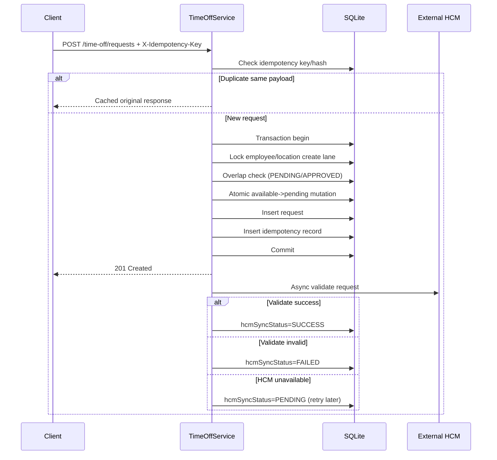

# Technical Requirements and Design (TRD)

## 1. Problem Statement

Build a reliable time-off service that accepts employee leave requests, enforces balance invariants, and remains available even when the upstream HCM system is slow or unavailable.

The system must avoid duplicate writes, prevent overlapping requests, and preserve data integrity under concurrent traffic.
The HCM platform is treated as the external source of truth for long-horizon entitlement reconciliation, while this service is the source of truth for immediate request lifecycle decisions and user-facing latency. That split creates a difficult sync problem: if HCM is degraded, the service still needs to accept valid requests without violating local invariants. The design therefore prioritizes deterministic local safety first, then converges with HCM through async retries and batch reconciliation.

## 2. Goals

- Support full request lifecycle: create, approve, reject, cancel, list, get.
- Guarantee idempotent create writes using a client-supplied key.
- Preserve balance invariant at all times:
  - `available + pending + used = total`
- Protect against race conditions and overlap conflicts.
- Keep request-write latency bounded during HCM failures.
- Retry and reconcile HCM synchronization asynchronously.
- Provide auditable sync logs for operations visibility.

## 3. Non-Goals

- Payroll-grade entitlements policy engine.
- Multi-region active/active conflict resolution.
- Strongly consistent cross-system distributed transactions (2PC).
- Production-grade authn/authz (documented as a hardening recommendation).

## 4. Constraints and Assumptions

- Backend stack: NestJS (JavaScript), TypeORM, SQLite.
- External HCM is unreliable and may return timeouts/503/partial snapshots.
- API callers can retry and may replay requests.
- Requests are date-range based and counted as inclusive day spans.

## 5. High-Level Architecture

High-level flow:

```text
Client -> TimeOffController -> TimeOffService -> SQLite (transactional commit)
              |
              +-> HcmService (retry + circuit breaker)
                |
                +-> External HCM

Scheduled workers:
HcmSyncService.retryPendingHcmSyncs -> retries PENDING sync records
HcmSyncService.runBatchSync -> reconciles local balances with HCM snapshot
```

Components:

- `TimeOffService`
  - Handles lifecycle transitions and idempotent create flow.
- `BalanceService`
  - Owns all balance read/write rules and invariant-preserving mutations.
- `HcmService`
  - Single HTTP facade over HCM with retry + circuit breaker.
- `HcmSyncService`
  - Background retry worker + batch reconciliation scheduler.
- `AllExceptionsFilter`
  - Normalized API error envelopes.
- `LoggingInterceptor`
  - Request/response timing and diagnostics.

Data stores:

- `time_off_requests`
- `idempotency_records`
- `employee_balances`
- `sync_logs`

## 6. Domain Model and State Machines

### 6.1 Request Status

- `PENDING -> APPROVED | REJECTED | CANCELLED`
- Terminal states: `APPROVED`, `REJECTED`, `CANCELLED`

### 6.2 HCM Sync Status

- `PENDING` (awaiting retry or upstream availability)
- `SUCCESS` (upstream acknowledged)
- `FAILED` (deterministic validation mismatch or retry exhaustion)
- `SKIPPED` (no upstream mutation required for current state)

## 7. Sequence Flows

### 7.1 Create Request (Local-first commit)



### 7.2 Approve Request

1. Load request with write lock.
2. Validate transition `PENDING -> APPROVED`.
3. Move balance `pending -> used` in the same transaction.
4. Commit local state.
5. Async notify HCM approval.
6. Update `hcmSyncStatus` based on upstream outcome.

### 7.3 Retry Worker

Runs on cron (`HCM_PENDING_RETRY_CRON`).

- Fetch requests with `hcmSyncStatus=PENDING`.
- Route behavior by request status:
  - `PENDING`: validation-only retry.
  - `APPROVED`: validate (if needed) then notify approval.
  - `REJECTED/CANCELLED`: mark `SKIPPED`.
- Enforce max attempts; mark `FAILED` when exceeded.

### 7.4 Batch Reconciliation

Runs on cron (`BATCH_SYNC_CRON`) or manual trigger.

- Pull full HCM snapshot.
- For each record compare local total vs HCM total.
- If drift positive, increase local available (safe accrual path).
- If drift negative, mark discrepancy and do not auto-reduce.
- Mark local records omitted by HCM snapshot as discrepancy entries.
- Persist `sync_logs` with `COMPLETED/PARTIAL/FAILED` outcome.

## 8. Consistency and Concurrency Strategy

### 8.1 Idempotency

- Keyed by `X-Idempotency-Key`.
- Hash mismatch on same key returns `409` conflict.
- Stored in same transaction as create write, preventing phantom records.

### 8.2 Overlap Safety

- Overlap check occurs inside transaction.
- Request creation lane serialized by employee/location lock key.

### 8.3 SQLite-Specific Handling

- Driver-aware lock fallback (`pessimistic_write` skipped for SQLite).
- Transient transaction collision detection (`SQLITE_BUSY`, `SQLITE_LOCKED`, nested-tx errors).
- Bounded retry with short backoff for create transaction.

### 8.4 Consistency Model in Practice

The service uses a local-first commit model: request writes and balance mutations are committed transactionally before any upstream dependency call is required. This keeps latency stable and prevents user-visible failures during transient HCM incidents, at the cost of eventual rather than immediate cross-system consistency. Sync state is explicitly tracked (`PENDING/SUCCESS/FAILED/SKIPPED`) so operations can detect and remediate drift rather than assume hidden success. During reconciliation, positive drift is applied automatically because it is non-destructive (accrual-safe), while negative drift is flagged as discrepancy and never auto-applied to avoid silently reducing employee entitlements.

## 9. Error Model

All errors are normalized by global filter:

- `statusCode`
- `error` (domain error code)
- `message`
- `requestId`
- `timestamp`
- `path`
- optional `details`

Representative error codes:

- `MISSING_IDEMPOTENCY_KEY`
- `INSUFFICIENT_BALANCE`
- `OVERLAPPING_REQUEST`
- `IDEMPOTENCY_CONFLICT`
- `INVALID_STATUS_TRANSITION`
- `REQUEST_NOT_FOUND`
- `BALANCE_NOT_FOUND`

## 10. Resilience Strategy

- Outbound HCM calls wrapped with:
  - retry (`maxAttempts`, `baseDelay`)
  - circuit breaker (`failureThreshold`, `resetTimeout`)
- Service remains available under upstream outages by committing locally first.
- Reconciliation and retry workers restore eventual consistency.

## 11. Alternatives Considered

### Option A: Distributed transaction (2PC) with HCM

Rejected:

- HCM typically does not provide XA/transaction enlistment.
- Operational complexity and fragility were too high for this domain.

### Option B: Strictly synchronous create requiring HCM success

Rejected:

- Coupled UX latency and availability directly to upstream health.
- Violates resilience goal during upstream incidents.

### Option C: Eventual consistency (selected)

Accepted:

- Deterministic local invariants and good user latency.
- Transparent async sync state with retries and audit logs.

### Option D: Event sourcing with append-only ledger

Partially attractive because a ledger provides strong auditability and replay, but not selected for this assessment scope due to implementation complexity and migration overhead in a small service. The current transactional model already provides durable request and sync audit tables sufficient for operational debugging. Event sourcing remains viable if product requirements expand to retroactive policy recomputation or multi-service projections.

### Option E: Polling-only reconciliation vs webhook-first sync

Pure polling was rejected because it increases consistency lag and can miss tight operational windows after approvals. Webhook-first plus scheduled polling fallback was considered, but the external HCM simulator and assumed real-world constraints did not guarantee reliable webhook semantics for this project. The implemented compromise is immediate async notifications for near-real-time convergence, backed by scheduled retry and batch polling for correctness.

### Option F: Optimistic-only locking vs pessimistic write locking

Optimistic-only locking can improve throughput under low contention, but in this domain concurrent leave submissions on the same employee/location can cause expensive conflict churn and poor user ergonomics. Pessimistic write semantics were preferred where supported, with SQLite-aware fallback and bounded retries to handle driver constraints. This reduces double-spend risk and produces clearer failure behavior for clients using idempotency keys.

## 12. Observability

- Structured logs for create/approve/reject/cancel and sync outcomes.
- Sync logs persisted with counts and error details.
- Circuit breaker status available via service-level accessor.

## 13. Testing Strategy and Evidence

Test levels:

- Unit: service behavior and branch-heavy edge cases.
- Integration: SQLite + spawned mock HCM lifecycle behavior.
- E2E: HTTP contract and high-concurrency request scenarios.

Latest verified coverage (global):

- Statements: 89.19%
- Branches: 74.44%
- Functions: 85.18%
- Lines: 89.93%

Service-layer coverage is above 80% for all service files.

## 14. Productionization Notes

Before production rollout:

- Replace `synchronize: true` with migrations.
- Move from SQLite to PostgreSQL/MySQL for higher write concurrency.
- Add authentication and role-based authorization.
- Add distributed lock for multi-instance batch trigger coordination.
- Add metrics export (request latency, retry count, drift count).

## 15. Known Limitations

Authentication and authorization are intentionally out of scope in this submission, so deployment to untrusted networks would require identity, role checks, and endpoint hardening before go-live. SQLite was chosen for deterministic local execution and assessment speed, but write concurrency and operational tooling are limited compared to managed PostgreSQL. The current process-level in-memory guard for batch overlap (`_batchRunning`) is safe for single-instance runtime, but multi-instance deployments require a distributed lock or database advisory lock. Automatic downward balance correction is intentionally disabled to avoid accidental entitlement reduction, which means discrepancy queues may require manual operational review. Finally, schema sync is currently configured for development velocity, so production rollout must use explicit migrations and controlled rollout procedures.
